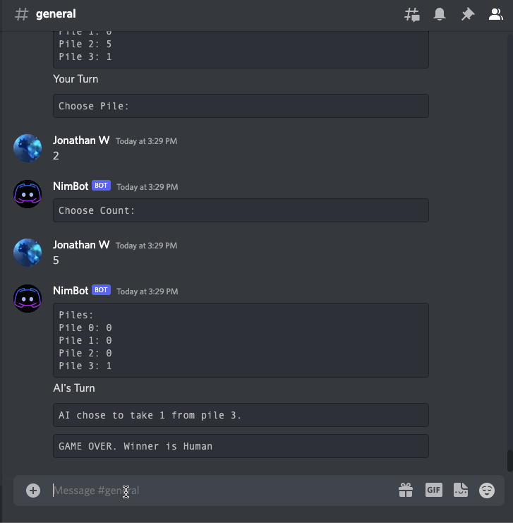
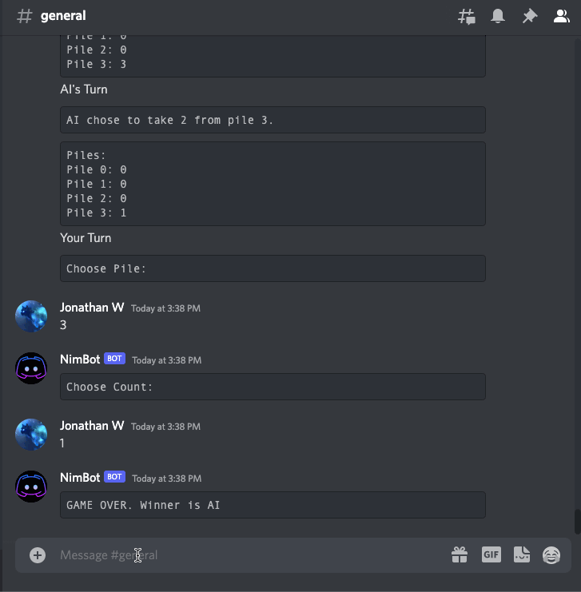

## Overview

This is a discord bot that plays nim, a mathematical game of strategy in which two players take turns removing nodes from distinct piles, against others through chat. Players will play the game with the bot by following the instructions printed in the chat and the final records will be stored in MongoDB, allowing each player to track their records against the bot. As for the game engine for nim bot, I incorporated the project I finished in Harvard's CS50AI course to train the bot against itself using reinforcement learning.

## Commands

* !play - allow player to start a nim game with the bot
* !history - show the match history of the player

## Demonstration

A game instance

Match history lookup

